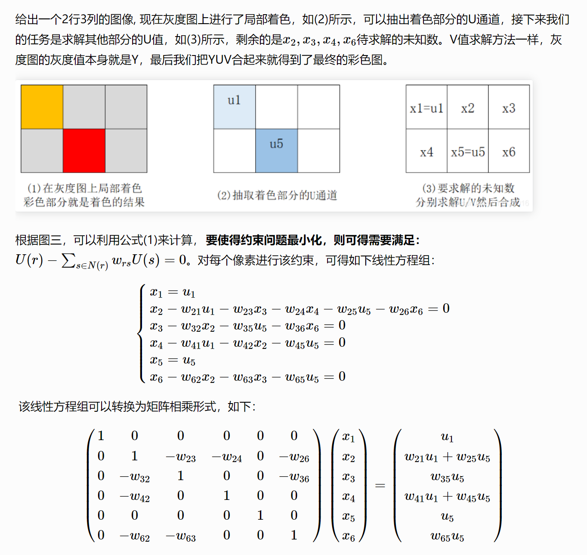

# 基础知识

## YUV空间

1. **Y（亮度）：**
   - 表示图像的亮度信息，即灰度级别。Y分量表示图像中每个像素的亮度级别，它决定了图像的明暗程度。Y的取值范围通常是0到255，其中0表示最暗，255表示最亮。
2. **U（蓝色色度）：**
   - 表示图像中蓝色与亮度的差异。U分量用于描述颜色中的蓝色成分，它与亮度结合起来决定了图像的颜色。U的取值范围通常是-128到127，其中0表示中性灰色。
3. **V（红色色度）：**
   - 表示图像中红色与亮度的差异。V分量用于描述颜色中的红色成分，它与亮度结合起来决定了图像的颜色。V的取值范围通常是-128到127，其中0表示中性灰色。

# colorization using optimization

## 算法原理

本文实现的是基于YUV颜色空间进行的，Y为单色亮度通道，U和V为颜色通道，Y为本身的灰度值

重要前提：在时间和空间内**具有相似的灰度等级**的像素也会具有**相同的颜色**，换句话说即为如果两个像素点在Y空间上有相似的数值，也会有相似的颜色。

公式如下，r和s都为像素点。而且$w_{rs}$为权重，为衡量强度相似性的权重，而且度不同的U和V分别进行计算。

约束条件为在求解未知的U和V中，如果在Y空间具有相似的强度，那么在U和V空间也有相似的颜色。

$$\begin{gathered}
J(U) =\sum_r(U(r)-\sum_{s\in N(r)}w_{rs}U(s))^2 \\
J(V) =\sum_r(V(r)-\sum_{s\in N(r)}w_{rs}V(s))^2 \\w_{rs}\propto exp(\frac{-(Y(r)-Y(s))^2}{2\sigma_r^2})
\end{gathered}$$

算法思想为基于距离和色度混合的彩色化算法，用户设定颜色的线条，根据某种特定距离公式计算每个像素点到颜色线条的距离，最近的线条颜色即为改像素点的颜色，属于**快速算法**，但是只考虑了距离的影响，忽略了颜色聚类的影响。

即为X为自变量，AX=b，b为所需要求解的U和V，A为有关于w的矩阵，X为假设的自变量。

求解的优化目标如下。

$$U(r)-\sum_{s\in N(r)}w_{rs}U(s)=0\text{}$$

具体的例子如下所示（比较好理解）



## 代码介绍

### 注意事项

1. U和V的取值范围为[-127, 128]，在计算过程中需要加绝对值
2. 如果没有上色，U和V都为0
3. A为与w权重相关的矩阵，即为权重矩阵w（计算相似性），代码运用sparse.lil_matrix创建
4. 如果没有标记颜色，找出相邻像素，计算相似性得出结果，将结果放置于矩阵
5. center = [r, c, Y[r, c]]为一个列表，第一个元素为行，第二个元素为列，第三个为强度值
4. neighbors为多个[r, c, Y[r, c]]存储生成的列表，在此中生成的存放了一个像素点区域内的邻居像素点
4. w的维度为size，因为是权重矩阵，所以约等于需要求解所有的权重那就将所有的都包含进去。

### 函数以及参数介绍

1. src为原始图像，marked为标记图像，src需要转化为RGB形式，因此需要互换通道，w为权重矩阵，而且w中的维度为（row\*col， row\*col）
2. find_neighbors(center, pic)， 找到像素周围的邻居，pic为像素点Y通道强度。返回结果为存放为[r, c, pic[r, c, 0]]，而且pic为三维数组，考虑像素点是否为边界像素点，最终扫描的区域为3*3的范围。
3. affinity_a(neighbors, center)，获取邻居像素的强度和中间像素的强度，获取像素点，计算强度的差值和均方差，随后运用权重公式求取获得权重，随后将其放入让返回之中。
4. to_seq(r, c, rows)为创建索引函数

## 具体实现代码

```
#窗口半径为1，效果最好
 
import numpy as np
import cv2 as cv
import colorsys
import matplotlib.pyplot as plt
import scipy.sparse as sparse
from scipy.sparse.linalg import spsolve
src = cv.imread('example.bmp') #cv读取的是BGR格式
src = src[:,:,::-1] # 第一通道和第三通道互换，实现BGR到RGB转换
_src = src.astype(float) / 255
marked = cv.imread('example_marked.bmp')
marked = marked[:,:,::-1]
_marked = marked.astype(float) / 255
Y,_,_ = colorsys.rgb_to_yiq(_src[:,:,0],_src[:,:,1],_src[:,:,2]) # Y通道是原灰度图的
_,U,V = colorsys.rgb_to_yiq(_marked[:,:,0],_marked[:,:,1],_marked[:,:,2]) # 待求的U和V是marked图像的
yuv=colorsys.rgb_to_yiq(_marked[:,:,0],_marked[:,:,1],_marked[:,:,2])
yuv=np.stack(yuv,axis=2)
y=yuv[:,:,0]
 
 
rows = _src.shape[0]
cols = _src.shape[1]
size = rows * cols
# 统计marked图像中标记过颜色的像素位置
# isColored，hhash为一个rows，cols的二维矩阵
hhash = isColored=abs(_src - _marked).sum(2) > 0.01 # 灰度图的U和V为0，但是有颜色的话就会大于0
W = sparse.lil_matrix((size, size))
 
 
def find_neighbors(center, pic):
    neighbors = []
    # 1. 求出该像素的邻居遍历范围，同时要考虑像素在边界
    r_min = max(0, center[0] - 1)
    r_max = min(pic.shape[0], center[0] + 2)
    c_min = max(0, center[1] - 1)
    c_max = min(pic.shape[1], center[1] + 2)
    # 遍历所有的邻居像素
    for r in range(r_min, r_max):
        for c in range(c_min, c_max):
            # 自己本身忽略
            if r == center[0] and c == center[1]:
                continue
            # 2. 存放邻居像素的xy位置，以及邻居像素的强度，用于后面计算权重的
            neighbors.append([r, c, Y[r,c]])
    return neighbors
 
def affinity_a(neighbors, center):
    # 创建一个新的数组，存放权重，同时保留邻居像素的信息，因此可以直接copy数组neighbors
    nbs = np.array(neighbors)
    # 1. 获取邻居像素的强度和中间像素的强度
    sY = nbs[:,2] # 邻居像素的强度
    cY = center[2] # 中间像素的强度
    # 2. 强度差值
    diff = sY - cY
    # 3. 计算均方差
    sig = np.var(np.append(sY, cY))
    if sig < 1e-6:
        sig = 1e-6
    # 4. 根据公式求权重
    wrs = np.exp(- np.power(diff,2) / (sig * 2.0))
    # 5. 加权求和，记得wrs是负数
    wrs = - wrs / np.sum(wrs)
    nbs[:,2] = wrs # 记录权重
    return nbs
 
def to_seq(r, c, rows):
    return c * rows + r
# 遍历所有像素
# 遍历所有像素
for c in range(cols):
    for r in range(rows):
        # 1. 将该像素的位置和其强度存在center里面，并计算索引
        center = [r, c, Y[r, c]]
        c_idx = to_seq(r, c, rows)
        # 2. 如果该像素没有上过色
        if not hhash[r,c]:
            # 2.1 找到该像素的邻居像素
            neighbors = find_neighbors(center, yuv)
            # 2.2 计算权重，weight[0]、weight[1]表示邻居的xy位置，weight[2]表示权重
            weights = affinity_a(neighbors, center)
            # 2.3 放入对应行，因为像素是按顺序遍历的，所以weightData存放的也是按顺序的
            for e in weights:
                # 2.3.1 计算center像素和邻居像素的索引
                n_idx = to_seq(e[0], e[1], rows)
                # 2.3.2 放入矩阵
                W[c_idx, n_idx] = e[2]
        # 3. 如果该像素上过色，则直接放入自己本身的信息，权重为1
        W[c_idx, c_idx] = 1.0
matA = W.tocsr()
 
b_u = np.zeros(size)
b_v = np.zeros(size)
idx_colored = np.nonzero(hhash.reshape(size, order='F'))
u = yuv[:,:,1].reshape(size, order='F')
b_u[idx_colored] = u[idx_colored]
v = yuv[:,:,2].reshape(size, order='F')
b_v[idx_colored] = v[idx_colored]
 
ansU = sparse.linalg.spsolve(matA, b_u)
ansV = sparse.linalg.spsolve(matA, b_v)
def yuv_to_rgb(cY,cU,cV):
    ansRGB = [colorsys.yiq_to_rgb(cY[i],cU[i],cV[i]) for i in range(len(ansY))]
    ansRGB = np.array(ansRGB)
    ans = np.zeros(yuv.shape)
    ans[:,:,0] = ansRGB[:,0].reshape(rows, cols, order='F')
    ans[:,:,1] = ansRGB[:,1].reshape(rows, cols, order='F')
    ans[:,:,2] = ansRGB[:,2].reshape(rows, cols, order='F')
    return ans
 
ansY = Y.reshape(size, order='F')
ans1 = yuv_to_rgb(ansY,ansU,ansV)
 
plt.imshow(ans1)
plt.title("Colorized_without_sidewindow")
plt.show()
plt.imsave('e_color_without_sidewindow.bmp',ans1)
```

# 侧窗滤波下的colorzation

## 备注

1. padding为窗口半径
2. 先将图像从BGR转化为YUV通道，取YUV中的Y亮度作为输入，olorsys.rgb_to_yiq函数返回三个元组，随后运用np.stack变换成常见三维数组
3. 运用hhash共有图像size的bool矩阵保存是否被上色
4. YY为扩充了padding的矩阵，保证了在图像边缘也可以扫描以及避免越界
5. 在best函数里面，寻找到最优窗口，padding也为半径大小，center参数放置的是x，y和像素强度，在best函数之中，为什么不判断LL和RR和UP和DOWN基于边界中（其实可以判断这里值计算LL，RR，UP和DOWN）不计算其他窗口
6. 随后初始化边缘，找到对应的模型以及函数

## 代码

```
import cv2
import numpy as np
import cv2 as cv
import colorsys
import matplotlib.pyplot as plt
import scipy.sparse as sparse
from scipy.sparse.linalg import spsolve

padding = 2  # 窗口半径、图片填充大小
# src放置的是灰度图,marked是放置已经标记成果的图片
src = cv.imread('test_gray.bmp')  # cv读取的是BGR格式
#src_gary = cv2.cvtColor(src, cv.COLOR_BGR2GRAY)
# src = np.array([src_gary for i in range(3)]).reshape(src.shape)
# src = src_gary
#cv2.imwrite('./data/{}'.format('gili_gary.bmp'), src_gary)
src = src[:, :, ::-1]  # 第一通道和第三通道互换，实现BGR到RGB转换
_src = src.astype(float) / 255 #对图像进行归一化处理，将范围变成[0,1]
marked = cv.imread('test_2.bmp') #读取标记照片
marked = marked[:, :, ::-1] # 第一通道和第三通道互换，实现BGR到RGB转换
_marked = marked.astype(float) / 255 #对图像进行归一化处理，将范围变成[0,1]
#YUV是模拟彩色电视的彩色模型，Y代表的是亮度分量，UV代表的是色度分量
#这段代码的目的是将标记图像的色彩信息应用到灰度图像中，从而达到彩色化的目的
Y, _, _ = colorsys.rgb_to_yiq(_src[:, :, 0], _src[:, :, 1], _src[:, :, 2])  # Y通道是原灰度图的
_, U, V = colorsys.rgb_to_yiq(_marked[:, :, 0], _marked[:, :, 1], _marked[:, :, 2])  # 待求的U和V是marked图像的
yuv = colorsys.rgb_to_yiq(_marked[:, :, 0], _marked[:, :, 1], _marked[:, :, 2])#将标记图像从RGB转换为YUV模式
yuv = np.stack(yuv, axis=2) #这行代码将Y，U，V分量堆叠成一个新的numpy数组yuv。
y = yuv[:, :, 0] #提取亮度分量

rows = _src.shape[0]
cols = _src.shape[1]
size = rows * cols
# 统计marked图像中标记过颜色的像素位置
hhash = abs(_src - _marked).sum(2) > 0.01  # 灰度图的U和V为0，但是有颜色的话就会大于0，创建了一个布尔矩阵来判断True为标记颜色的
#像素点位置
# hhash = (abs(U) + abs(V)) > 0.0001
W = sparse.lil_matrix((size, size))
#创建了一个大小为size x size的稀疏矩阵W。稀疏矩阵是一种特殊的矩阵，它的大部分元素都是0，只有少数元素是非零的。
#稀疏矩阵在处理大规模数据时可以节省存储空间和计算时间。

YY = np.zeros((Y.shape[0] + 2 * padding, Y.shape[1] + 2 * padding))
#这行代码创建了一个新的零矩阵YY，其大小比Y矩阵大2 * padding。

#两个for循环将Y矩阵的值复制到YY矩阵的中心位置，而YY矩阵的边缘位置则保持为零。
#这是一种常见的图像处理技术，称为边缘填充（padding），它可以避免在进行像素邻域操作时出现边界问题。
for i in range(YY.shape[0]):
    for j in range(YY.shape[1]):
        YY[i, j] = -10  # 填充后可避免越界
for i in range(Y.shape[0]):
    for j in range(Y.shape[1]):
        YY[i + padding, j + padding] = Y[i, j]

#侧窗滤波的概念主要体现在best函数中。这个函数的目标是找到最适合的窗口。
#在这个函数中，首先定义了一个中心像素点，然后围绕这个中心像素点创建了多个窗口。
#这些窗口包括上窗口（UP）、下窗口（DOWN）、左窗口（LL）和右窗口（RR）。
#对于非边界像素，还定义了四个角窗口：左上（NW）、右上（NE）、左下（SW）和右下（SE）。
#然后，计算了每个窗口的平均值，并将其与中心像素的值进行比较，找出与中心像素值最接近的窗口。
#这就是侧窗滤波的主要思想：通过比较中心像素与其周围窗口的值，选择最佳的窗口进行滤波，从而保留图像的边缘信息。
#在代码中，还使用了一个技巧来处理非边界像素。
#对于非边界像素，我们不希望选择角窗口（NW、NE、SW、SE），因为这些窗口可能会跨越图像边缘。
#因此，给这些窗口赋予了一个非常大的值（100），这样在比较窗口值时，这些窗口就不会被选择。

#best函数用来寻找合适的窗口，半径较小时，对于非边界部分的像素，不建议使用比较小的窗口，
#如NW，NE，SW，SE，所以我们在非边界位置的时候赋予它们一个非常大的值：100，这样这些窗口都不会被选择到。
def best(center): #center代表的是窗口的中心点
    # 使用填充后的图像下标
    r = center[0] + 1 * padding #计算填充后图像的行
    c = center[1] + 1 * padding #计算填充后图像的列
    y = center[2] #获取中心点的第三个数据值
    # 定义窗口的范围（padding前面有提到过，半径）
    r_min = r - padding
    r_max = r + padding + 1
    c_min = c - padding
    c_max = c + padding + 1

    # 进行切片选择相应的窗口
    # 计算左右上下四个窗口的平均值
    LL = YY[r_min:r_max, c_min:c + 1].mean() #左窗口
    RR = YY[r_min:r_max, c:c_max].mean() #右窗口
    UP = YY[r_min:r + 1, c_min:c_max].mean() #上窗口
    DOWN = YY[r:r_max, c_min:c_max].mean() #下窗口

    # NW = YY[r_min:r + 1, c_min:c + 1].mean()
    # NE = YY[r_min:r + 1, c:c_max].mean()
    # SW = YY[r:r_max, c_min:c + 1].mean()
    # SE = YY[r:r_max, c:c_max].mean()
    # if这里是判断是否为边界像素
    if (center[0] < padding or center[0] > Y.shape[0] - padding - 1) and (
            center[1] < padding or center[1] > Y.shape[1] - padding - 1):
        NW = YY[r_min:r + 1, c_min:c + 1].mean()
        NE = YY[r_min:r + 1, c:c_max].mean()
        SW = YY[r:r_max, c_min:c + 1].mean()
        SE = YY[r:r_max, c:c_max].mean()
    # 如果是非边界像素，就给他一个非常大的值，这样，这些位置就不会被选择到
    else:
        SE = 100.0
        SW = 100.0
        NE = 100.0
        NW = 100.0
    # 计算了每个窗口的平均值与中心点的差值的绝对值。
    res = abs(np.array([NE, NW, UP, LL, RR, SW, SE, DOWN]) - y)
    rr_min = r_min
    rr_max = r_max
    cc_min = c_min
    cc_max = c_max
    # 找到差值最小的窗口
    MIN = res.argmin()
    # 根据min的值来寻找最佳窗口
    for i in range(8):
        if i == MIN:
            if i == 0:
                rr_min = r_min
                rr_max = r + 1
                cc_min = c
                cc_max = c_max
                break
            elif i == 1:
                rr_min = r_min
                rr_max = r + 1
                cc_min = c_min
                cc_max = c + 1
                break
            elif i == 2:
                rr_min = r_min
                rr_max = r + 1
                cc_min = c_min
                cc_max = c_max
                break
            elif i == 3:
                rr_min = r_min
                rr_max = r_max
                cc_min = c_min
                cc_max = c + 1
                break
            elif i == 4:
                rr_min = r_min
                rr_max = r_max
                cc_min = c
                cc_max = c_max
                break
            elif i == 5:
                rr_min = r
                rr_max = r_max
                cc_min = c_min
                cc_max = c + 1
                break
            elif i == 6:
                rr_min = r
                rr_max = r_max
                cc_min = c
                cc_max = c_max
                break
            else:
                rr_min = r
                rr_max = r_max
                cc_min = c_min
                cc_max = c_max
                break
        else:
            continue
    # 返回原图像的下标
    rr_min -= 1 * padding
    rr_max -= 1 * padding
    cc_min -= 1 * padding
    cc_max -= 1 * padding
    return (rr_min, rr_max, cc_min, cc_max)

# 目的是找到给定中心点的所有邻居像素
def find_neighbors(center):  # centre [r,c,y]
    neighbors = []
    # 选出最优窗口范围
    r_min, r_max, c_min, c_max = best(center)
    # 遍历所有的邻居像素
    for r in range(r_min, r_max):
        for c in range(c_min, c_max):
            # 自己本身忽略
            if r == center[0] and c == center[1]:
                continue
            # 存放邻居像素的xy位置，以及邻居像素的强度，用于后面计算权重的
            neighbors.append([r, c, Y[r, c]])
    return neighbors

# 目的是计算给定中心点的所有邻居像素的权重
def affinity_a(neighbors, center):  # (r,c,y)
    # 创建一个新的数组，存放权重，同时保留邻居像素的信息，因此可以直接copy数组neighbors
    nbs = np.array(neighbors)
    # 1. 获取邻居像素的强度和中间像素的强度
    sY = nbs[:, 2]  # 邻居像素的强度
    cY = center[2]  # 中间像素的强度
    # 2. 强度差值
    diff = sY - cY
    # 3. 计算均方差
    sig = np.var(np.append(sY, cY))  # 维度相同才可以追加
    if sig < 1e-6:
        sig = 1e-6
    # 4. 根据公式求权重
    wrs = np.exp(- np.power(diff, 2) / (sig * 2))
    # 5. 加权求和，记得wrs是负数
    wrs = - wrs / np.sum(wrs)
    nbs[:, 2] = wrs  # 记录权重
    return nbs


# 返回值为邻居的权重：[(r,c,w),(r,c,w)]

# 创建索引
# 将二维坐标转化成一维索引的函数
def to_seq(r, c, cols):
    return r * cols + c


# 遍历所有像素

for r in range(rows):
    for c in range(cols):
        # 1. 将该像素的位置和其强度存在center里面，并计算索引
        center = [r, c, Y[r, c]]  # yuv[(r, c)][0]
        c_idx = to_seq(r, c, cols)
        # 2. 如果该像素没有上过色
        if not hhash[r, c]:
            # 2.1 找到该像素的邻居像素
            neighbors = find_neighbors(center)
            # 2.2 计算权重，weight[0]、weight[1]表示邻居的xy位置，weight[2]表示权重
            weights = affinity_a(neighbors, center)
            # 2.3 放入对应行，因为像素是按顺序遍历的，所以weightData存放的也是按顺序的
            for e in weights:
                # 2.3.1 计算center像素和邻居像素的索引
                n_idx = to_seq(e[0], e[1], cols)
                # 多加入了转换，这里的话迭代的时间较长，所以需要注意
                n_idx = int(n_idx)
                c_idx = int(c_idx)
                # 2.3.2 放入矩阵
                W[c_idx, n_idx] = e[2]
        # 3. 如果该像素上过色，则直接放入自己本身的信息，权重为1
        W[c_idx, c_idx] = 1.0
matA = W.tocsr()

#初始化两个0向量
b_u = np.zeros(size)
b_v = np.zeros(size)
idx_colored = np.nonzero(hhash.reshape(size)) # 找到了所有已经上色的像素的索引
u = yuv[:, :, 1].reshape(size) # 获取了图像的U通道
b_u[idx_colored] = u[idx_colored] # 将已经上色的像素的U通道的值存储在向量b_u中
v = yuv[:, :, 2].reshape(size) # 获取了图像的V通道
b_v[idx_colored] = v[idx_colored] # 将已经上色的像素的V通道的值存储在向量b_v中

# 解决了线性方程组，并将结果重新塑造为原始图像的形状
ansU = spsolve(matA, b_u).reshape(marked.shape[0], marked.shape[1])
ansV = spsolve(matA, b_v).reshape(marked.shape[0], marked.shape[1])

# YUV转换成rgb格式
r = Y + 0.9468822170900693 * ansU + 0.6235565819861433 * ansV
r = np.clip(r, 0.0, 1.0)
g = Y - 0.27478764629897834 * ansU - 0.6356910791873801 * ansV
g = np.clip(g, 0.0, 1.0)
b = Y - 1.1085450346420322 * ansU + 1.7090069284064666 * ansV
b = np.clip(b, 0.0, 1.0)
#并将最终的RGB存储再Ans中
Ans = np.stack((r, g, b), axis=2)

plt.imshow(Ans)
plt.title("Colorized_with_sidewindow")
plt.show()
plt.imsave('bestwu3.bmp', Ans)

#侧窗滤波是一种图像处理技术，它的主要目标是在进行图像滤波时保留图像的边缘信息。传统的滤波算法，如均值滤波、高斯滤波等，通常会导致图像边缘的模糊，
#因为它们将待处理的像素置于滤波器核心的中心位置，这会导致滤波窗口在跨越边缘时，引入对来自于边缘两侧像素值的加权计算。
#侧窗滤波技术的核心思想是将每个目标像素视为一个潜在的边缘，并在其周围生成多个局部窗口（称为边窗口），每个局部窗口将目标像素与窗口的边或角（而不是窗口的中心）对齐。
#这样，滤波窗口就尽可能地位于边缘的一侧，从而减轻甚至消除滤波窗口跨越边缘带来的影响。
#侧窗滤波技术可以将原本不保边的滤波器变成保边滤波器。这意味着，无论原来的滤波器是否保边，侧窗滤波版本都可以让它保边。
#这种技术在图像去噪、平滑、高动态范围（HDR）应用、结构纹理分解、深度估计、上色等多种应用中都表现出了优秀的效果。
```


# 参考

[侧窗彩色化代码](https://blog.csdn.net/qq_52300384/article/details/128322428)

[《Colorization Using Optimization》论文理解与复现 ](https://www.cnblogs.com/3-louise-wang/p/16687822.html)

# 思路

1. 可以通过一次上采样获取高分辨率图像，查看是否能够解决问题
2. 找到了一篇文章但是没有代码，Deep Edge-Aware Interactive Colorization against Color-Bleeding Effects